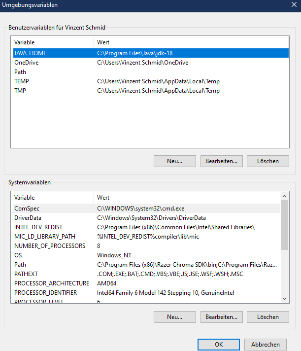
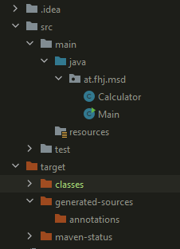
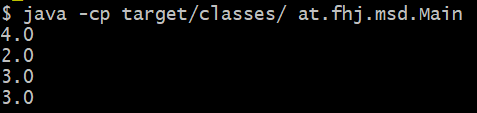
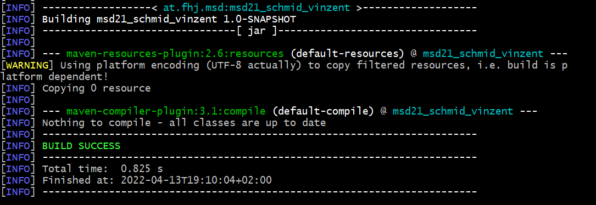

# Exercise 3
### The purpose of this exercise was to get in touch with maven

## 1. Set JAVA_HOME and path variables

## 2.Set up maven and java

## 3. Develop calculator and main class in package at.fhj.msd

## 4. Build main class in IntelliJ
When I compiled the main class, a new target folder was created with subfolders like classes, generated-sources and maven-status

## 5. Checked if I see the result also in the console with:
>java -cp target/classes/ at.fhj.msd.Main

with this command I got the following results:

## 6. Last but not least I built the maven file in the console with:
>mvn compile

Unfortunately I had problems to compile the maven file. So after long research it worked with
